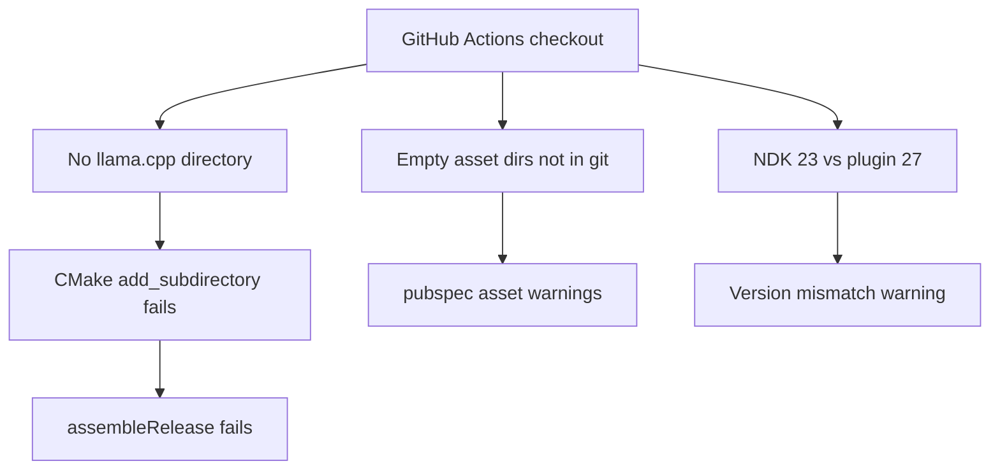
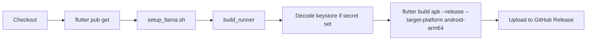

# Fix Release APK Build + Optional Map Env

## Problem diagnosis

Your CI log shows **three separate issues**. Only one is fatal:

| Issue | Severity | Root cause |
|-------|----------|------------|
| `llama.cpp` directory missing | **Build failure** | [`android/app/.gitignore`](android/app/.gitignore) excludes `src/main/cpp/llama.cpp/`; CI never runs [`setup_llama.sh`](android/app/src/main/cpp/setup_llama.sh) |
| NDK 23 vs 27 mismatch | Warning (should fix) | [`android/app/build.gradle.kts`](android/app/build.gradle.kts) uses `ndkVersion = flutter.ndkVersion` (23.x on CI) while plugins require 27.x |
| `assets/images/` and `assets/models/` not found | Warning (should fix) | Empty dirs exist locally but are **not tracked by git**; Flutter fails asset resolution on fresh checkout |

**Map `.env` is not causing the build failure.** Mapbox is already optional at runtime — [`MapConfig`](lib/core/config/map_config.dart) catches load errors and falls back to OpenStreetMap. CI does not need `MAPBOX_ACCESS_TOKEN` to build or ship an APK.



---

## Part 1 — Fix CI release build (critical)

### 1. Clone llama.cpp in CI before building

Add a step in [`.github/workflows/ci.yml`](.github/workflows/ci.yml) **after** `flutter pub get` and **before** the build steps:

```yaml
- name: Setup llama.cpp native dependency
  run: bash android/app/src/main/cpp/setup_llama.sh
```

Improve [`setup_llama.sh`](android/app/src/main/cpp/setup_llama.sh) to pin a known-good commit for reproducible CI builds (instead of `git pull` on latest main):

```bash
LLAMA_CPP_COMMIT="<pinned-sha>"  # e.g. a recent stable tag
git clone https://github.com/ggerganov/llama.cpp.git
cd llama.cpp && git checkout "$LLAMA_CPP_COMMIT"
```

Also add `setup_llama.sh` to README Quick Start (currently missing — developers hit the same error locally on fresh clone).

### 2. Pin Android NDK to 27.0.12077973

In [`android/app/build.gradle.kts`](android/app/build.gradle.kts), replace:

```kotlin
ndkVersion = flutter.ndkVersion
```

with:

```kotlin
ndkVersion = "27.0.12077973"
```

This matches what Flutter/plugins expect on CI and removes the version mismatch warning.

### 3. Track empty asset directories in git

Add placeholder files so CI checkout includes the dirs referenced in [`pubspec.yaml`](pubspec.yaml):

- [`assets/images/.gitkeep`](assets/images/.gitkeep)
- [`assets/models/.gitkeep`](assets/models/.gitkeep)

(Models are downloaded at runtime; these dirs are intentionally empty in the repo.)

### 4. Release arm64-v8a APK only (your choice)

Native LLM is hardcoded to arm64 in Gradle CMake args (`-DANDROID_ABI=arm64-v8a`). Building armeabi-v7a/x86_64 split APKs would produce APKs **without** the native library.

Changes:

**[`android/app/build.gradle.kts`](android/app/build.gradle.kts)** — restrict ABIs:

```kotlin
defaultConfig {
    ndk {
        abiFilters += listOf("arm64-v8a")
    }
}
```

**[`.github/workflows/ci.yml`](.github/workflows/ci.yml)** — build only arm64:

```yaml
run: flutter build apk --release --target-platform android-arm64
```

Remove the universal APK step and update the rename/release-notes steps to only expect `app-arm64-v8a-release.apk`.

### 5. Wire release signing from CI secrets

CI already writes keystore + passwords to [`android/local.properties`](.github/workflows/ci.yml) (lines 99–115), but [`build.gradle.kts`](android/app/build.gradle.kts) always uses debug signing:

```kotlin
signingConfig = signingConfigs.getByName("debug")
```

Add a standard `signingConfigs { create("release") { ... } }` block that reads `storeFile`, `storePassword`, `keyAlias`, `keyPassword` from `local.properties` when present, and falls back to debug signing for local unsigned builds.

---

## Part 2 — Make map env properly optional (keep code for users)

Runtime behavior is already correct (OSM + OSRM work without token). Small hardening changes:

### 1. Make `.env` load truly optional in [`map_config.dart`](lib/core/config/map_config.dart)

```dart
await dotenv.load(fileName: ".env", isOptional: true);

const envToken = String.fromEnvironment('MAPBOX_ACCESS_TOKEN', defaultValue: '');
_mapboxToken = dotenv.env['MAPBOX_ACCESS_TOKEN'] ?? envToken;
if (_mapboxToken != null && _mapboxToken!.isEmpty) _mapboxToken = null;
```

- `isOptional: true` — no error when `.env` is absent (CI, fresh clone, release builds)
- `String.fromEnvironment` — advanced users can pass `--dart-define=MAPBOX_ACCESS_TOKEN=pk...` without a file

### 2. Document optional `.env` in pubspec (don't bundle secrets)

In [`pubspec.yaml`](pubspec.yaml), add a commented asset line so users who want Mapbox know what to uncomment:

```yaml
assets:
  - assets/images/
  # Optional — uncomment after creating .env with MAPBOX_ACCESS_TOKEN:
  # - .env
```

Do **not** commit `.env` or add it to assets by default (keeps CI/release builds secret-free).

### 3. Remove misleading Google Maps manifest entry

Delete unused meta-data from [`AndroidManifest.xml`](android/app/src/main/AndroidManifest.xml) (lines 37–39). The app uses `flutter_map`, not Google Maps SDK — this placeholder confuses users into thinking a Google API key is required.

### 4. Update [`.env.example`](.env.example) and README

Clarify that Mapbox is optional and the app works fully on OpenStreetMap without any env setup. Trim README env vars that aren't implemented (`OPENROUTE_API_KEY`, `DEFAULT_MODEL`, etc.) or mark them as planned.

**No changes needed** to route screens, `SmartRoutingService`, or `MapProviderSelector` — they already gate Mapbox behind `isMapboxAvailable`.

---

## Expected CI flow after changes



---

## Files to change

| File | Change |
|------|--------|
| [`.github/workflows/ci.yml`](.github/workflows/ci.yml) | Add llama.cpp setup; arm64-only build; simplify APK rename/release |
| [`android/app/build.gradle.kts`](android/app/build.gradle.kts) | Pin NDK 27; arm64 abiFilters; release signing from local.properties |
| [`android/app/src/main/cpp/setup_llama.sh`](android/app/src/main/cpp/setup_llama.sh) | Pin llama.cpp commit SHA |
| [`assets/images/.gitkeep`](assets/images/.gitkeep) | New — track empty dir |
| [`assets/models/.gitkeep`](assets/models/.gitkeep) | New — track empty dir |
| [`lib/core/config/map_config.dart`](lib/core/config/map_config.dart) | `isOptional: true` + dart-define fallback |
| [`pubspec.yaml`](pubspec.yaml) | Commented optional `.env` asset |
| [`android/app/src/main/AndroidManifest.xml`](android/app/src/main/AndroidManifest.xml) | Remove unused Google Maps key |
| [`README.md`](README.md) | Add `setup_llama.sh` step; clarify optional Mapbox env |

---

## Verification

After implementing, trigger a release build via push to `main`, tag `v*`, or `workflow_dispatch` and confirm:

1. `setup_llama.sh` completes and `llama.cpp/` exists before Gradle runs
2. No CMake `add_subdirectory` error
3. No pubspec asset directory errors
4. APK is signed (if secrets set) and uploaded to GitHub Release
5. App launches without `.env` — maps show OSM tiles, routing uses OSRM/offline
